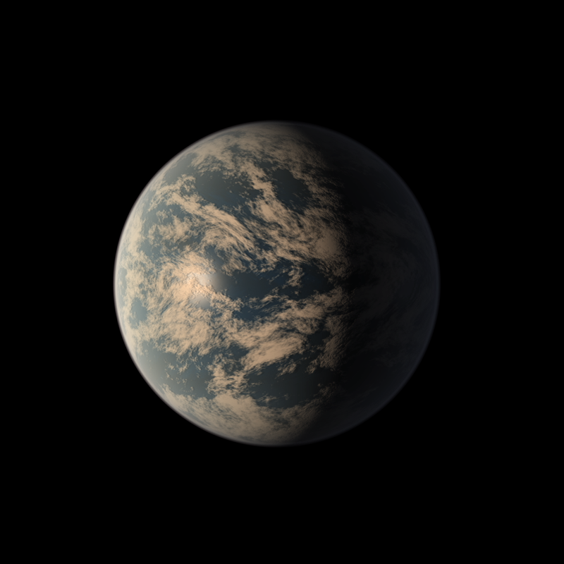

Astrat - Chrome Extension 

With Astrat each new tab shows the user a random planet from the TRAPPIST-1 system. The TRAPPIST-1 system is a solar system famous for its "close distance" to earth (12 parsecs) and the high potential for life on one of its planets. 
Next to the image of the planet, the user can find the name of the depicted planet and other speccifics about TRAPPIST-1. 

My favorite is TRAPPIST-1d, depicted below, which has temperatures around 6°C and is likely to consist to 5% of water!

