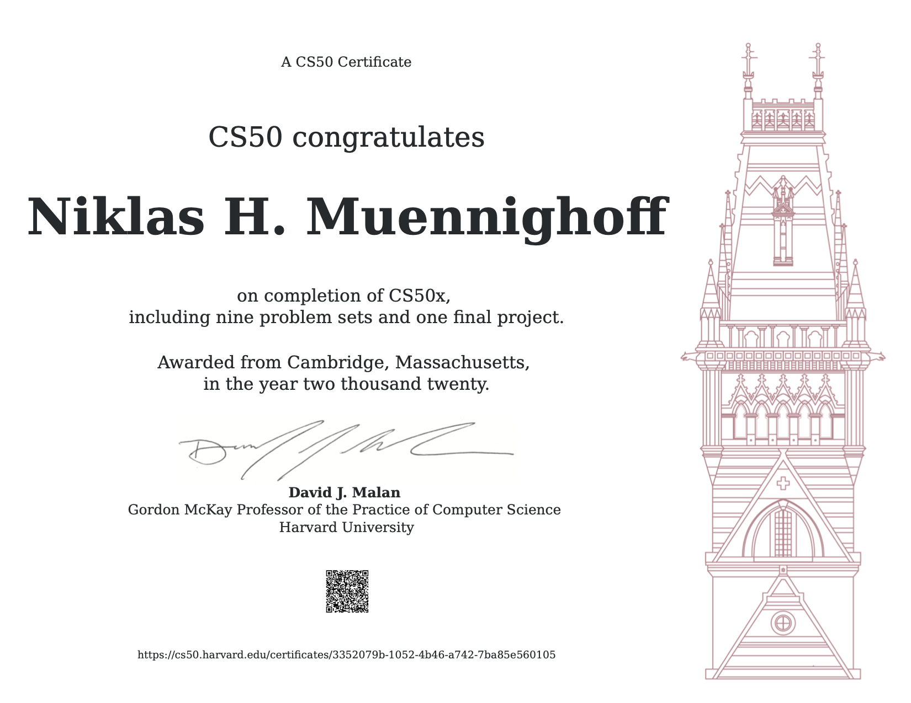

# CS50

The course covers the fundamentals of computers & coding. 

The following are core topics: 

- C
- Python
- Databases & SQL
- HTML, CSS, Javascript & Flask

https://cs50.harvard.edu/x/2020/

